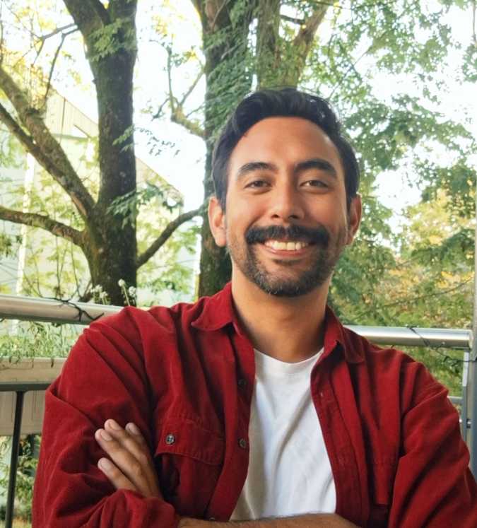

{width=250px .rounded-circle}

# Computational Biologist | Bioinformatician | Data Scientist

I am a computational scientist with a PhD in Evolutionary Biology, specializing in data analysis, statistical modeling, and scalable computational workflows. I use programming, and reproducible pipelines to extract insights from complex datasets, with expertise in biological and genomic applications.

During my PhD and postdoctoral research at the University of Zurich, I developed reproducible computational pipelines for large genomic datasets using R, Bash, HPC environments, and modern bioinformatics tools.

## My interests include:

- Comparative genomics
- Population genomics
- RNA-seq analysis
- Genome assembly
- Bioinformatics pipeline development
- Reproducible research

## What I build

- Data analysis pipelines for large and complex datasets
- Reproducible computational workflows
- Statistical models approaches
- Automated data processing systems
- Scientific software and analytical tools
- High-performance computing solutions

---
